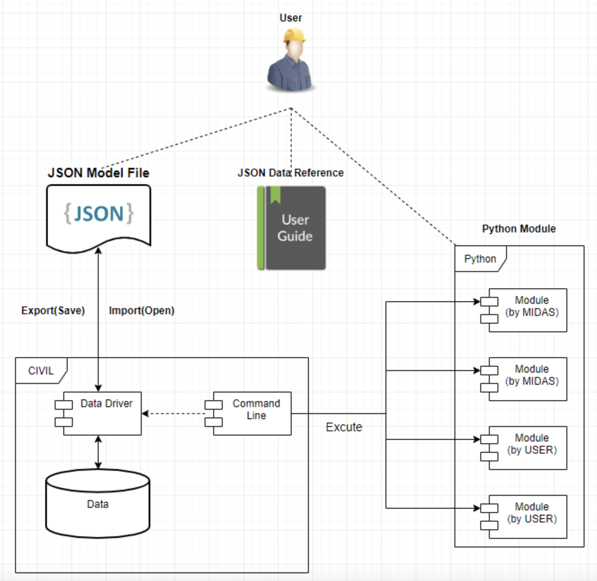

# CONTENTS

### [1. 마이다스 API란? ](#1-마이다스-api란)
### [2. API 호출 도구 (End Point)](#2-api-호출-도구)
1. API Command Window (제품 내 커맨드창)
2. API Set command File (Batch 파일)
3. Global Command, GCMD (터미널 확장)
### [3. API 문법 및 명령 규칙 ](#3-api-문법-및-명령-규칙)
1. [Query](#query)
   1. [LVALUE](#lvalue)
   2. [OPERATOR](#operator)
      + `Read`
      + `Create (+=)`
      + `Update (*=)`
      + `Delete (-=)`
      + `Query Struct (?=)`
   3. [RVALUE](#rvalue)
2. [Function](#function)
    1. [Function for Python](#function-for-python)
    2. [Function for MAPI](#function-for-mapi)
    3. [Excel Sheet Function](#function-for-excel-sheet-concept)
3. [Action](#action)
    + [Civil Doc Action List](#civil-doc-action-list)
### [4. Civil API ](#4-civil-api)
1. [Civil API Concept ](#civil-api-concept)
2. [Civil API Setting ](#civil-api-setting)
3. [Civil API Excution ](#civil-api-excution)
### [5. Civil API 질문사항 ](#5-civil-api-질문사항)
* [PSC 계산서 프로토타입 개발 자료 ](#psc-계산서-프로토타입-개발-자료)
### [6. 참고 ](#6-참고문서)
+ [API 데이터 정의 ](#api-데이터-정의)

&nbsp;
***
&nbsp;

# 1. 마이다스 API란?
[*.. contents*](#contents)  
[*Reference Documentation*](https://midasitdev.atlassian.net/wiki/spaces/CIMB/pages/1116373064/API)
> midas application programming interface  
프로그래밍 Interface...

 * `USER` 제품에 데이터를 많이 입력한다.
 * `PRODUCT`  사용자로부터 데이터를 많이 입력 받는다.

따라서 사용자가 입력 데이터를 직접 __생성/수정/삭제__ 하도록 만들어 주자.  
사용자는 기능 개발을 기다리지 않아도 되고  
우리도 역할을 분리함으로써 데이터 정의와 간단한 구현에 집중 할 수 있다.  
~~추후에는 기능도 USER가 직접...~~  

&nbsp;
***
&nbsp;

# 2. API 호출 도구
[*.. contents*](#contents)  
[*Reference Documentation*](https://midasitdev.atlassian.net/wiki/spaces/CIMB/pages/1116405900/End+Point)
> API 조작 Tool  
[End Point](https://midasitdev.atlassian.net/wiki/spaces/CIMB/pages/1116405900/End+Point) 라 명명.  
제대로 구현된 건 아직 없는 듯 하고 계속 업데이트 하는 단계인 듯.  

 * [__API Command Window__](https://midasitdev.atlassian.net/wiki/spaces/CIMB/pages/1116405890/CIVIL+API+Command+window?atlOrigin=eyJpIjoiZWViODVhYjNiZDllNDg1NTkxZjY4NTRiZWJlNmM2YzMiLCJwIjoiYyJ9)  
프로그램 내부 명령해 활용. 사용자가 제품의 변화를 직접 볼 수 있는 장점이 있다.
 * [__API Set command File__](https://midasitdev.atlassian.net/wiki/spaces/CIMB/pages/1115750505/API+Set+Command+File?atlOrigin=eyJpIjoiZWViODVhYjNiZDllNDg1NTkxZjY4NTRiZWJlNmM2YzMiLCJwIjoiYyJ9)  
입력 JSON파일 지정 시, 파일 내의 문법에 따라 자동 실행되는 batch 파일 개념.
 * [__Global Command, GCMD__](https://midasitdev.atlassian.net/wiki/spaces/CIMB/pages/1118077053/GCMD?atlOrigin=eyJpIjoiZWViODVhYjNiZDllNDg1NTkxZjY4NTRiZWJlNmM2YzMiLCJwIjoiYyJ9)  
일반적인 터미널 이라고 생각하면 될듯하다.

&nbsp;
***
&nbsp;

# 3. API 문법 및 명령 규칙
[*.. contents*](#contents)
> 기본 명령어는 라인 단위로 처리 된다.  
Query, Fuction, Action 세가지로 구분된다.  
Query + Function은 조합이 가능하지만, Action은 단독으로만 쓸 수 있다.  

&nbsp;
***
&nbsp;

## Query
[*.. contents*](#contents)  
데이터 생성/수정, 조회가 가능하다.  
기본적인 형태는 다음과 같다.  
```cpp
DB.NODE.1 += {"X":0, "Y":0, "Z":0}
//LVALUE - OPERATOR - RVALUE의 구조를 가지고 있다.
```
&nbsp;

#### LVALUE
[*.. contents*](#contents)
###### Target
```cpp
DB.NODE.1
//DB,   Category (범주)
//NODE, Name (데이터 이름)
//1,    ID (아이디)
```

Name (데이터 이름)의 경우 우측 문서 참고, [API Data Reference](https://midasitdev.atlassian.net/wiki/spaces/CIMB/pages/1118076993/API+Data+Reference?atlOrigin=eyJpIjoiNmZhM2Q3NDFlM2I3NGM5NDhiYjJjM2M1NzdiMTQ4MGQiLCJwIjoiYyJ9)  
추가적으로, ID 이하 레벨도 아래와 같이 접근이 가능하다.
```cpp
> NODE             // 'Name'
> NODE.1           // 'Name + Specific ID'
> NODE.(1-3,5,7)   // 'Name + Multi ID's'
> NODE.1.X         // 'Name + Specific ID + Specific Field'
> NODE.(1-3,5,7).X // 'Name + Multi ID's + Specific Field'
> NODE.().X        // 'Name + All ID's + Specific Field'
```
&nbsp;

#### OPERATOR
[*.. contents*](#contents)
###### Operation 행위, 일반적인 [CRUD](https://ko.wikipedia.org/wiki/CRUD)의 동작부와 유사. 

| Subject | Operator | Description |
| :---: | :---: | :---: |
| READ | none | 조회, 별도의 연산자 없이 LVALUE 입력으로 해당 데이터가 출력된다. |

```cpp
LVALUE // 기본 조회 구조

> NODE         // 모든 노드 조회
> NODE.1       //  1번 노드 조회
> NODE.(1-5).  // 1~5번 노드 조회
> NODE.1.X     // 1번 노드의 X 조회
> NODE.(1-5).X // 1~5번 노드의 X 조회
```

| Subject | Operator | Description |
| :---: | :---: | :---: |
| CREATE | += | 생성, '+=' 연산자를 이용해 데이터를 생성한다. |
> LVALUE Target에 필수적인 구조를 완결성 있게 제공해야 한다.  
데이터 구조 최하위 변수 값을 생성 할 때에는 실제 Type과 일치하는지 확인해야 한다.  
만약 NODE의 좌표값이 __정수형__이라면 __실수__와 같은 값을 입력하면 안된다.  
###### 지금은 InsertAt (특정 위치에 데이터를 생성)만 구현된 상태인 듯
```cpp
LVALUE += RVALUE // 기본 생성 구조

> NODE   += {"1":{"X":0, "Y":0, "Z":0}, "2":{"X":1, "Y":1, "Z":1}} // 1, 2번 노드 데이터 일괄 생성
> NODE.1 += {"X":0, "Y":0, "Z":0}                                  // 1번 노드 데이터 생성
```

| Subject | Operator | Description |
| :---: | :---: | :---: |
| UPDATE | *= | 수정, '*=' 연산자를 이용해 데이터를 수정한다. |
> Create 연산자와 달리 RVALUE의 경우 계층구조에 포함된 일부 변수만으로도 사용할 수 있다.  
데이터 구조 최하위 변수 값을 변경 할 때에는 실제 Type과 일치하는지 확인해야 한다.  
만약 NODE의 좌표값이 __정수형__이라면 __실수__와 같은 값을 입력하면 안된다.  
```cpp
LVAULE *= RVALUE // 기본 수정 구조

> NODE     *= {"1":{"X":2}, "2":{"X":3}} // 1, 2번 노드 X Field 각각 수정
> NODE.()  *= {"1":{"X":2}, "2":{"X":3}} // 1, 2번 노드 X Field 각각 수정
> NODE     *= {"1":{"X":2}, "2":{"Z":1}} // 1번 노드 X, 2번 노드 Z 개별 수정
> NODE.1   *= {"Y":2, "Z":3}             // 1번 노드 Y, Z만 수정
> NODE.1.X *= 4                          // 1번 노드의 X Field값을 4로 수정
```

| Subject | Operator | Description |
| :---: | :---: | :---: |
| DELETE | *= | 삭제, '-=' 연산자를 이용해 데이터를 삭제한다. |
```cpp
LVALUE -= RVALUE // 기본 삭제 구조

> NODE       -= // 전체 노드 삭제
> NODE.1     -= // 1번 노드 삭제
> NODE.(1-5) -= // 1~5번 노드 삭제
```

| Subject | Operator | Description |
| :---: | :---: | :---: |
| QUERY STRUCT | ?= | __도움말__ 정도로 추측 되는데 현재 예제가 없음. |
```cpp
LVALUE ?= // 기본 ... 구조

> NODE ?=
```

&nbsp;

#### RVALUE
[*.. contents*](#contents)
###### Value
> 위 "@ OPERATOR"에서 언급 했듯이 '__+=__'와 '__*=__'를 사용할 수 있다.  
JSON 객체 또는 변수의 값이 될 수 있으므로 [JSON 문법](https://midasitdev.atlassian.net/wiki/spaces/~673925652/pages/932708405/JSON)을 준수 해야한다.

&nbsp;
***
&nbsp;

## Function
[*.. contents*](#contents)
> Python과 MAPI가 존재한다.

&nbsp;

#### Function (for Python)
[*.. contents*](#contents)  
[*Reference Documentation*](https://midasitdev.atlassian.net/wiki/spaces/CIMB/pages/1116045441?atlOrigin=eyJpIjoiNDY0MGQyNmI2MGNiNGNlYWFmMTE1MzIxNzU3ODE1ODgiLCJwIjoiYyJ9)
> Python 확장 모듈을 호출 할 수 있는 명령  
Python 확장 모듈을 사용하기 위해서는 미리 정의된 모듈이 존재해야 한다.  
제품에서 배포하는 모듈은 실행파일 설치 경로의 PYMODULE 경로에 있다.  
사용자 작성 모듈 역시 동일한 경로에 배치 되어야 한다.  

```cpp
PY.Calculator.Center(DB.NODE)
// BASE   PY - MODULE - FUNC - LVALUE PARAM
// PY     Python 확장 모듈을 이용하겠다는 선언
// MODULE Python 스크립트 파일 이름 선택
// FUNC   Python 스크립트 파일 내 함수명 선택
// PARAM  함수에 넘길 파라미터 전달
```

`Py`  
Python 확장 모듈 함수 호출 카테고리  

`Module`  
Python 모듈 이름 (Python 파일 이름)  

`Func`  
Python 함수 이름    

`LValue Param`  
Query와 동일한 LVALUE  
LVALUE를 매개변수로 넣는다면 LVALUE의 평가값이 파라미터로 처리된다. (==JSON Data)  

`Return` (함수의 반환값)  
Python 확장 모듈 함수의 경우 반환값이 존재하기 때문에 대입 연산도 가능하다.  
아래와 같이 사용할 수 있다.  
```cpp
DB.NODE.1 += PY.Calculator.Center(DB.NODE)
// LVALUE - OPERATOR - RVALUE (Python 모듈의 반환값)
```

명령을 수행하는 예는 다음과 같다.  
```cpp
//Calculator.py 파일
def Center(jsonStr):
    ...
```
위와 같은 Python 스크립트가 있고 내부에 함수 Center가 존재한다면,  
API 명령 도구를 이용해 `PY.Calculator.Center(NODE)`와 같이 입력하면 정상동작 한다.  
여기서, `NODE`와 같은 기존 `LVALUE`도 이용할 수 있다.  

###### Regular Expression (정규식)에 대한 고민도 하고 계신 듯 하다.

&nbsp;

#### Function (for MAPI)
[*.. contents*](#contents)  
[*Reference Documentation*](https://midasitdev.atlassian.net/wiki/spaces/CIMB/pages/1117913185)
> Python 확장 모듈과는 별개로 제품 내 명령 윈도우창을 활용해서 Command를 할 수 있다.

&nbsp;

#### Function (for Excel Sheet) concept
[*.. contents*](#contents)  
[*Reference Documentation*](https://midasitdev.atlassian.net/wiki/spaces/CIMB/pages/1184006157/EXCEL+SHEET+FUNCTION+REPORT)
> Excel을 활용한 간단한 계산, 계산서 Concept

현재 검토 단계이며 이것저것 시도 해보고 있는 중 인듯함.

* __사용자가 Excel Form으로 만든 계산식에 Civil 데이터를 넣어 계산이 가능한가?__  
Python 스크립트를 이용해서 가능성을 검토한 결과 O.K  

근데 위처럼 하려면, 사용자가 Excel도 하고 Python도 다를 수있어야 함.  
실제 대부분의 사용자들은 엑셀을 잘 다루는 사람이 더 많을테니 다른 방법도 고민.  

* __Python 연결부 스크립트는 우리가 제공하고, Excel 계산을 연결시켜주자__  
우리가 표준화된 Excel Sheet를 제공하고, 해당 Sheet에서 사용자가 직접 수정할 수 있도록 하자.  

```cpp
> PY.MIDAS.EXCEDGN(Excel Path)
// 예상해보자면 이런 명령어?
```
사실 위 아이디어처럼 구현 한다면 궂이 Python을 추가도 설치하지 않고도,  
기존에 설치 된 C++/C#을 이용하는 것도 한 방법이 될 수 있다.  
결국 사용자 입장에서 더 편할 수도 있다는 것이다.  
사용자의 접근성과 프로그램의 안정성 측면에서도 우위를 차지하고 있는 듯 하며,  
해당 방식이 유리한 것으로 보여진다.  

추가로,
* __공유 된 `Excel Data`(계산식, 보고서, 계산서 등)를 활용할 수 있는 Platform?__  
우리(마이다스)는 `공유자`에 의해 작성된 `Data`를 검증하여 업로드 해주고,  
해당 `Data`를 사용하는 `USER`의 이용량에 따라 이익을 배분 한다.  
그럼 `공유자`도 본인의 이익을 위해 질 좋은 데이터를 업로드 할 것이고  
`USER`들은 양질의 `Data`를 받아 사용할 수 있게 된다.  

&nbsp;


***

&nbsp;

## Action 
[*.. contents*](#contents)  
[*Reference Documentation*](https://midasitdev.atlassian.net/wiki/spaces/CIMB/pages/1115979893)
> 제품의 동작을 제어 할 수 있는 명령

#### Civil Doc Action List
[*.. contents*](#contents)
```cpp
[Enable Action List]
NEW        // New Project
OPEN       // Open Project
SAVE(Path) // Save Project
CLOSE      // Close Project
EXIT       // Exit Project
IMPORT     // Import JSON File
EXPORT     // Export JSON File
ANAL       // Analysis Excution
```

&nbsp;
***
&nbsp;

# 4. Civil API  
[*.. contents*](#contents)  
[*Reference Documentation*](https://midasitdev.atlassian.net/wiki/spaces/CIMB/pages/648151084/Civil+API+Protytype)

&nbsp;

### Civil API Concept  
[*.. contents*](#contents)  
###### Civil의 Export/Impot 기능을 활용해서 Json 형태로 데이터를 관리한다.

  

* __기본적인 규칙__  
`.mcb` 확장자를 가진 binary file 대신, `json`을 사용한다.  
`json` 파일 Load/Save는 Export/Import를 이용한다.  
기본적으로 `json`파일은 civil 데이터에 포함되며, 사용자가 올바르게 입력하면 civil에서 정상적으로 읽을 수 있다.  
&nbsp;
* __기본 시나리오 (Import & Excution)__  
사용자가 `USER GUIDE`를 이해하고 `JSON`파일을 만든다.  
`CIVIL`에서 `IMPORT`기능을 통해 `JSON`파일을 불러온다.
사용자는 `CIVIL COMMAND LINE`에 명령을 실행한다.  

```cpp
`IMPORT`시, 제품에서 행하는 행위는 다음과 같을 것으로 예상된다.
`CIVIL`은 데이터 관리 객체인 `DATA DRIVER`을 통해 불러온 `JSON`파일을 처리한다.  
`DATA DRIVER`는 `JSON`파일을 `CIVIL`의 데이터 형태로 저장한다.  
마지막 줄은 할지 안할지를 잘 모르겠...
```
* __기본 시나리오 (Export)__  
`CIVIL`에서 `USER GUIDE` 근거 한 `JSON`파일을 생성한다.  
```cpp
`EXPORT`를 통해 생성한 `JSON`파일은 PRE / POST 로 나뉜다.
PRE는 Model Data 등
POST는 해석 결과 등
```

&nbsp;

## Civil API Setting
[*.. contents*](#contents)  
###### Command Line Interface를 이용한다. (With Python 모듈)

 `Civil Command Line`은 `.py` 확장자를 가진 Python 스크립트 파일을 실행할 수 있다.  
 제품에서 기본적인 Python 스크립트 파일은 제공한다. (View, Result ...)  
 사용자는 Python 스크립트를 작성해 로직을 커스텀 할 수 있다.  

&nbsp;

## Civil API Excution
[*.. contents*](#contents)  
###### Command Line Window 를 이용한다. (With Python 모듈)

```cpp
> Module Type.Method
// 위와 같은 형태로 입력하면 수행결과가 출력창에 표기 된다.

// 커맨드창에 아래 라인 입력
> CalCenter.CalCenter

// 아래 결과 출력 됨.
> CalCenter
> X:2.5, Y:3.0, Z:1.8
```

###### Window 터미널을 이용한다. (With Civil Function, ex Analysis...)
```cpp
// 단일 명령 입력 방법
> Civil.exe "Model.json" /py MyPyModule

// 다중 명령 입력 방법
> 방법을 찾는중.. ㅠㅠ
```

&nbsp;
***
&nbsp;

# 5. Civil API 질문사항
[*.. contents*](#contents)  
[*Reference Documentation*](https://midasitdev.atlassian.net/wiki/spaces/EnSolDev/pages/2088697861/PSC+API)

&nbsp;

## PSC 계산서 프로토타입 개발 자료 분석
[*.. contents*](#contents)  

###### MAPI Branch의 21.06.25일자 주성님 Commit 기준,  

`이 아래는 Command Line 관련된 놈인가..`

<details>
<summary style="font-weight : bold; color : #00714e">wg_gr / CommandInput</summary>

```cpp
// 라인에 입력된 명령들을 처리하는 곳 인듯.

Command 창에서 입력한 string 값은 CommandInput::SendKeyToInputTip 에서 처리한다.  
CommandInput [613]에 각 String별 조건에 따라 데이터를 가져오거나 조작한다.

CommandInput::SendKeyToInputTip
{
    auto* const pDBDoc = CDBDoc::GetDocPoint(); // DBDoc Pointer
    
    //Tools
    CQueryparser Parser;                               // Parsing 전문 객체
    auto* const pCmdMenuMgr = ICmdMenuMgr::Instance(); // Command 메뉴 매니징 Interface 객체

    const auto& strContent = GetContent(); // 명령라인의 내용 얻어오기

    if ( nKeyMsg == VK_RETURN ) // Key입력이 'enter'면
    {
        // Parser 이용
        auto strResult = _T(""); // Parsing 결과 인가봄
        if ( strCurPath == ">>DataBase>>" ) {         // DataBase DB?
            pDBDoc->StartEditDB();                    // Transaction START
            strResult = Parser.ProcessDB(strContent); // DB 갱신
            pDBDoc->CloseEditDB();                    // Transaction CLOSE
        }
        
        if ( strCurPath == ">>PythonModue>>" ) {  // Python Module?
            strResult = Parser.RunPY(strContent); // 모듈 실행
        }

        if ( strCurPath == ">>Settings>>") {      // Settings?
            strResult = Parser.RunST(strContent); // Setting 변경
        }

        if ( strCurPath == ">>API>>") {            // API?
            strResult = Parser.RunAPI(strContent); // API 실행
        }

        if ( !strResult.IsEmpty() ) { // Parsing 결과가 있으면
            if ( pDBDoc ) {
                pDBDoc->DisplayHistoryMessage(strResult); // Parsing 결과 표시
            }
        }

        if ( strCurPath == ">>Import Json File>>") { // Json Import
            pDBDoc->StartEditDB();                   // Transaction START
            Parser.OnImportJson(strContent);         // Json 파일 불러오기 (불러와서 데이터 갱신하나?)
            pDBDoc->CloseEditDB();                   // Transaction CLOSE
        }

        if ( strCurPath == ">>Export Json File>>") { // Json Export
            Parser.OnExportJson(strContent);         // Json 파일 불러오기 (불러와서 데이터 갱신하나?)
        }

        // AfxApp 이용
        if ( strCurPath == ">>Open File>>") {          // File Open?
            AfxGetApp()->OpenDocumentFile(strContent); // 모델 열기
        }

        ClearPrompt(); // 명령라인 날리기?
    }
}
```
</details>

<details>
<summary style="font-weight : bold; color : #00714e">wg_base / ICmdMenuMgr</summary>

```cpp
// Command Menu의 Export/Import 시, 동작을 결정하는 Interface인가
// OnExportJson = 0
// OnImportJson = 0 Method가 존재함.
```
</details>

<details>
<summary style="font-weight : bold; color : #00714e">wg_main / CommandMenuMgr : ICmdMenuMgr</summary>

```cpp
// 위에 ICmdMenuMgr의 Sub Class인 실체인듯.
// OnExportJson과 OnImportJson이 구현되어 있다능
```
</details>

<details>
<summary style="font-weight : bold; color : #00714e">wg_main / AppMain</summary>

```cpp

// 음 Application main 함수 인가.
// Load Command File, New/Open/Close File을 새롭게 정의 했군?
```
</details>

<details>
<summary style="font-weight : bold; color : #00714e">wg_main / MgtImport_DBG</summary>

```cpp
// 위 CommandMenuMgr에서 사용하는 객체
// Json 파일 Import 시 사용함.
// 이건 또 왜 이름이 다르지?
// 객체 이름이 CReadDBG
```
</details>

<details>
<summary style="font-weight : bold; color : #00714e">wg_main / MgtExport_toDBG</summary>

```cpp
// 위 CommandMenuMgr에서 사용하는 객체
// Json파일을 Export 할때에 strPath(경로?명령?)를 해당 객체에 줌.
// 객체 이름이 CMgrExport_toDBG
```
</details>

&nbsp;

`왠지 이놈부터는 document 리본 메뉴 인듯?`

<details>
<summary style="font-weight : bold; color : #00714e">wg_main / WGenDoc</summary>
```cpp
// 이놈은 Interface고, 실체는 ImplFile이 따로 있음.
// WGenDocImplFile
// OnFileExportGenwForDBG
// OnFileImportGenwDBG
```
</details>

&nbsp;
***
&nbsp;

# 6. 참고
[*.. contents*](#contents)  

&nbsp;

## API 데이터 정의  
[*.. contents*](#contents)  
[*Reference Documentation*](https://midasitdev.atlassian.net/wiki/spaces/CIMB/pages/1118076993/API+Data+Reference)  

지금까지 정의 된 여러 기본적인 구조체들의 집합체는 있으나,  
해당 내용을 정리하는 것 보다는 현재 Civil에 포진되어 있는 다양한 데이터를  
분석하고 이를 기반으로 새로운 json 데이터를 추출하는게 더 좋아 보임.  

